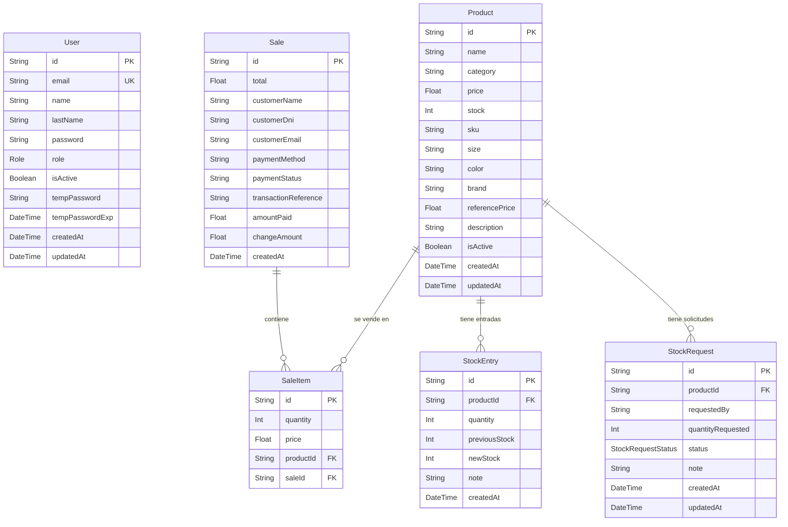
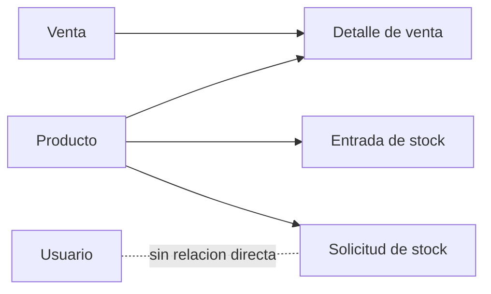

# Diagrama de Base de Datos

Este diagrama representa la estructura actual definida en `backend/prisma/schema.prisma`.



## Relaciones

- `Sale` tiene muchos `SaleItem`.
- `Product` tiene muchos `SaleItem`.
- `SaleItem` funciona como tabla intermedia entre ventas y productos.
- `Product` tiene muchas `StockEntry`, que registran aumentos o movimientos de inventario.
- `Product` tiene muchas `StockRequest`, que registran solicitudes de stock pendientes, aprobadas o rechazadas.
- `User` no tiene relaciones directas declaradas en Prisma actualmente.

## Enums

```prisma
enum Role {
  ADMIN
  USER
}

enum StockRequestStatus {
  PENDING
  APPROVED
  REJECTED
}
```

## Lectura Rapida

La base de datos esta centrada en `Product`. Desde productos se conectan las ventas mediante `SaleItem`, las entradas de inventario mediante `StockEntry` y las solicitudes de inventario mediante `StockRequest`.

El flujo principal queda asi:


